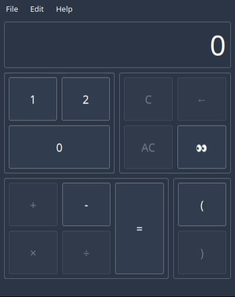

# Terncalc - The fun ternary calculator

I just wanted to test Qt and Rust without producing anything that could actually be useful.

Build (for debug on Linux) using `build.sh`. This requires, of course, current qt and rust installations.

I target Qt 6 but Qt 5 also works fine.

Use the "👀" button in order to see your last result in decimal.
